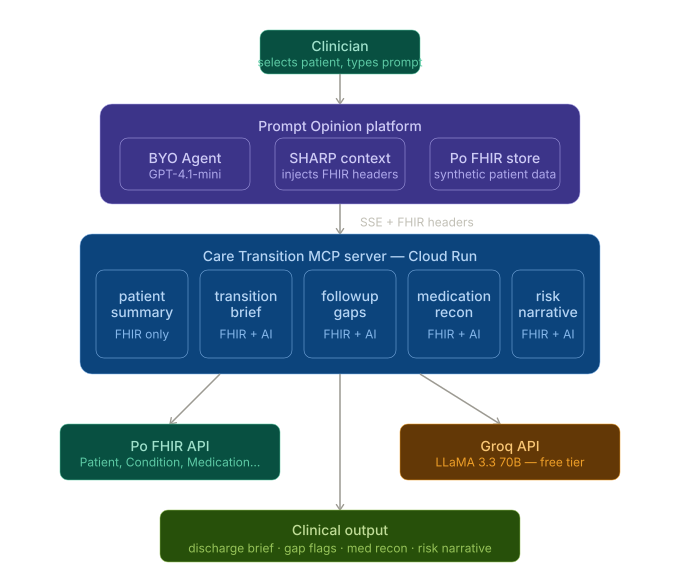

---
# Care Transition MCP

**Five FHIR-grounded tools for safer patient handoffs — built for the Prompt Opinion platform**

Hospital readmissions cost the US healthcare system $26 billion a year. The most common cause isn't clinical — it's a bad handoff. A nurse scrambles to write a discharge summary from scattered records, misses a pending lab result, forgets a follow-up appointment. The patient goes home without the right information, and comes back three weeks later.

This MCP server addresses that directly. Select a patient in Po, ask for a transition brief, and get a structured clinical document in seconds — pulled from real FHIR data, synthesized by AI.

---

## What it does

```
"Generate a care transition brief for this patient being discharged home."
```

The agent calls five tools in sequence:

1. **get_patient_summary** — pulls name, DOB, active conditions, medications from FHIR
2. **generate_transition_brief** — builds a 6-section handoff document
3. **flag_followup_gaps** — flags missing appointments, abnormal labs, medication follow-ups
4. **medication_reconciliation** — checks for duplicates, missing meds, dosage concerns
5. **readmission_risk_narrative** — generates a LOW/MODERATE/HIGH risk assessment with recommended actions

Each tool works independently. Any agent on the Po platform can use any one of them.

---

## Running locally

```bash
git clone https://github.com/YOUR_USERNAME/care-transition-mcp
cd care-transition-mcp

pip install -r requirements.txt

cp .env.example .env
# Add GROQ_API_KEY to .env (free at console.groq.com)

python main.py
# Server starts at http://localhost:8080/sse
```

---

## Deploying to Cloud Run

```bash
gcloud run deploy care-transition-mcp \
  --source . \
  --project YOUR_PROJECT_ID \
  --region us-central1 \
  --allow-unauthenticated \
  --port 8080

gcloud run services update care-transition-mcp \
  --set-env-vars GROQ_API_KEY=your_key_here
```

---

## Registering in Po

1. Configuration → MCP Servers → Add MCP Server
2. Endpoint: `https://YOUR_CLOUD_RUN_URL/sse`, Transport: SSE, Auth: None
3. Click Continue — Po will detect the SHARP FHIR extension
4. Toggle on the extension, authorize the FHIR scopes, save

---

## How FHIR context works

When a patient is selected in Po, three HTTP headers are injected into every tool call:

```
X-FHIR-Server-URL:    https://app.promptopinion.ai/api/workspaces/{id}/fhir
X-FHIR-Access-Token:  <bearer token>
X-Patient-ID:         <fhir patient id>
```

The server declares support for this via the SHARP extension in the MCP `initialize` response. Tools read the headers from a Python `ContextVar` set by a raw ASGI middleware — see the bug log below for why this approach was necessary.

---

## Stack

- **MCP framework**: FastMCP 1.9.0
- **Transport**: SSE (Server-Sent Events)
- **FHIR**: httpx calling Po's FHIR R4 API
- **LLM**: Groq API — LLaMA 3.3 70B
- **Hosting**: Google Cloud Run
- **Data**: Po synthetic EHR bundle (no real PHI)

---

## What I learned building this

Three bugs that weren't obvious and took real time to solve.

**`BaseHTTPMiddleware` crashes SSE.** I used Starlette's convenience middleware to capture FHIR headers. It crashed immediately with `AssertionError: Unexpected message: http.response.start`. The reason: `BaseHTTPMiddleware` buffers the HTTP response body before passing it downstream. SSE responses don't have a body — they stream indefinitely. Fixed it with a raw ASGI middleware class that passes `scope`, `receive`, `send` directly without touching the response.

**FHIR headers don't reach tool functions via `ctx.request_context.request`.** In SSE transport, that object is the GET `/sse` connection — established once. Tool calls come as POST requests to `/messages/` later, as a different request. I switched to a `ContextVar` set by the middleware on every incoming HTTP request. ContextVars propagate through async call chains, so the value set during the POST is visible inside the tool that runs within that same context.

**Po reads `capabilities.extensions`, not `capabilities.experimental`.** The SHARP spec and Po's own docs describe slightly different fields. FastMCP's `ServerCapabilities` Pydantic model doesn't have `extensions` in its schema, but uses `model_config = ConfigDict(extra="allow")`. Fixed it with injecting via `__pydantic_extra__` and verifying with `model_dump()` before deploying.

---

## Project structure

```
care-transition-mcp/
├── main.py                          # MCP server, SHARP extension, middleware
├── fhir/client.py                   # FHIR API calls using Po headers
├── llm/vertex.py                    # Groq client
├── tools/
│   ├── patient_summary.py
│   ├── transition_brief.py
│   ├── followup_gaps.py
│   ├── medication_reconciliation.py
│   └── readmission_risk.py
├── Dockerfile
└── requirements.txt
```

---
